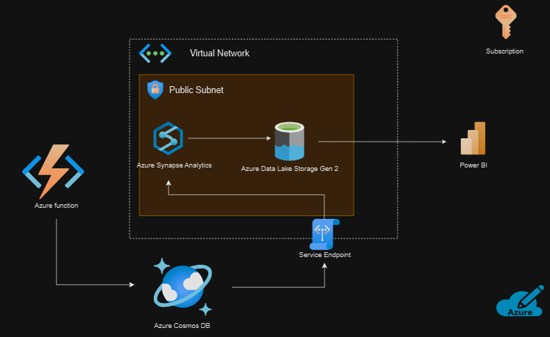

# Arquitectura de Procesamiento de Datos con Azure

## Descripción General

Este proyecto implementa una arquitectura de procesamiento de datos en tiempo real utilizando diversos servicios de Azure para almacenar, procesar y visualizar datos. La arquitectura ha sido actualizada con servicios nativos de Azure para reducir los costos y simplificar la implementación, manteniendo las mismas funcionalidades principales.

La arquitectura está diseñada para capturar y almacenar datos a través de Azure Function, procesarlos con Azure Synapse Analytics y almacenarlos en Azure Data Lake Storage Gen 2, mientras que Azure Cosmos DB se utiliza para almacenamiento adicional. Los resultados se visualizan en Power BI para obtener información procesable.

## Componentes de la Arquitectura

### 1. **Azure Function**
Azure Function se utiliza como un punto de entrada para el procesamiento de datos. Esta función recibe los datos en tiempo real desde una fuente externa (como una API de clima) y realiza transformaciones o preprocesamiento antes de almacenarlos en la base de datos.

### 2. **Azure Cosmos DB**
Los datos preprocesados se almacenan en Azure Cosmos DB, una base de datos NoSQL distribuida, que proporciona alta disponibilidad y escalabilidad. Azure Cosmos DB se usa para mantener los datos accesibles rápidamente para futuras consultas o procesos adicionales.

### 3. **Azure Synapse Analytics**
Azure Synapse Analytics se utiliza para ejecutar consultas analíticas complejas sobre los datos almacenados. En esta arquitectura, Synapse accede a los datos almacenados en Azure Data Lake Storage Gen 2 y proporciona una capa analítica escalable y poderosa.

### 4. **Azure Data Lake Storage Gen 2**
Azure Data Lake Storage Gen 2 es el repositorio principal de almacenamiento de datos en bruto y procesados. Este almacén de datos está diseñado para permitir el análisis de grandes volúmenes de datos, y se integra con Azure Synapse Analytics para realizar consultas eficientes.

### 5. **Power BI**
Power BI se utiliza para la visualización de los datos procesados. Los resultados de las consultas de Azure Synapse Analytics se transmiten a Power BI, lo que permite a los usuarios finales generar paneles de control e informes interactivos.

### 6. **Virtual Network y Subred Pública**
Todos los recursos principales están implementados dentro de una Virtual Network de Azure para asegurar la comunicación privada entre los servicios. Azure Synapse y Azure Data Lake Storage Gen 2 se encuentran en la misma subred pública, facilitando un acceso seguro y eficiente.

### 7. **Service Endpoint**
Un service endpoint se ha configurado entre Azure Data Lake Storage Gen 2 y Azure Cosmos DB para garantizar una comunicación segura entre estos servicios, protegiendo los datos contra accesos no autorizados y mejorando el rendimiento de las operaciones.

## Flujo de Datos
1. **Ingesta**: Los datos son recogidos por **Azure Function**, que los procesa y los guarda en **Azure Cosmos DB**.
2. **Almacenamiento**: Los datos se transfieren desde **Azure Cosmos DB** a **Azure Data Lake Storage Gen 2** para almacenamiento a largo plazo y análisis.
3. **Análisis**: **Azure Synapse Analytics** realiza consultas y análisis sobre los datos almacenados.
4. **Visualización**: Los resultados se visualizan en **Power BI** para ofrecer una vista integral de los datos y permitir la toma de decisiones.

## Justificación de Cambios
Tras un análisis del presupuesto proporcionado por el Chief Data Officer, se decidió modificar la arquitectura para evitar el uso de servicios costosos como Azure Databricks y Hive Metastore. En su lugar, se han utilizado servicios nativos de Azure que ofrecen funcionalidades similares con un costo más bajo y una integración más sencilla.

- **Azure Synapse Analytics** reemplaza a **Databricks** para el procesamiento de datos y análisis. Synapse proporciona una solución integrada que es altamente compatible con otros servicios de Azure, lo que reduce la complejidad de la configuración y los costos asociados.
- **Azure Data Lake Storage Gen 2** sigue siendo el almacén principal de datos, asegurando una solución escalable y económica para almacenar grandes volúmenes de datos en bruto y procesados.
- **Power BI** continúa siendo la herramienta de visualización, permitiendo generar informes y paneles interactivos de una manera sencilla y visualmente atractiva.

Estas modificaciones no solo disminuyen los costos generales de la arquitectura, sino que también simplifican la administración y el despliegue, lo cual es esencial para asegurar la viabilidad del proyecto en el largo plazo.

## Objetivos
- Proporcionar una solución escalable y segura para el procesamiento de datos en tiempo real.
- Permitir consultas analíticas sobre datos almacenados en el lago de datos.
- Facilitar la visualización de datos en tiempo real para obtener insights accionables.

## Requisitos
- **Cuenta de Azure** con permisos para desplegar recursos como Azure Function, Azure Synapse Analytics, Azure Cosmos DB, Azure Data Lake Storage y Power BI.
- **Herramientas de desarrollo** como Visual Studio Code o Azure Portal para la gestión y configuración de los recursos.

## Configuración e Implementación
1. **Azure Function**: Crear una función que se encargue de recibir los datos y almacenarlos en Cosmos DB.
2. **Azure Cosmos DB**: Configurar la base de datos para recibir los datos desde la función.
3. **Azure Synapse y Data Lake**: Configurar el acceso desde Synapse a los datos en Data Lake.
4. **Power BI**: Crear visualizaciones conectadas a Azure Synapse para el análisis de los datos.

## Seguridad
- Se utiliza una **Virtual Network** para limitar el acceso a los recursos.
- Los **Service Endpoints** aseguran la comunicación privada entre los servicios.

## Contribución
Sientete libre de contribuir a este proyecto abriendo issues o creando pull requests. Cualquier sugerencia para mejorar la eficiencia o agregar nuevas funcionalidades es bienvenida.

## Licencia
Este proyecto está bajo la licencia MIT. Consulte el archivo LICENSE para más detalles.

