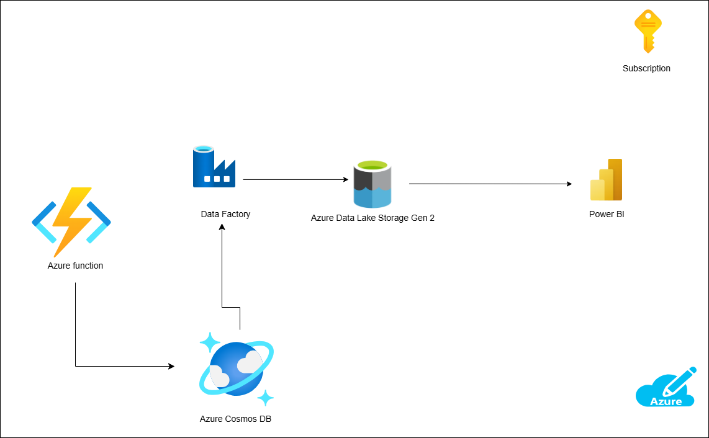

# Arquitectura: Flujo de Datos con Azure Functions, Cosmos DB, Data Factory, Data Lake y Power BI

## Descripción General

Esta arquitectura ilustra un flujo de procesamiento y visualización de datos utilizando los servicios de Azure. A continuación, se describe cada componente y su rol en el flujo:

### 1. **Azure Function**
- **Función:** Procesa eventos o datos en tiempo real provenientes de diversas fuentes.
- **Rol en la arquitectura:**
  - Extrae datos de una fuente (por ejemplo, sensores o una API externa).
  - Inserta los datos procesados directamente en **Azure Cosmos DB**.

### 2. **Azure Cosmos DB**
- **Función:** Es una base de datos NoSQL distribuida globalmente.
- **Rol en la arquitectura:**
  - Almacena los datos procesados por la Azure Function.
  - Actúa como fuente de datos para **Azure Data Factory**.

### 3. **Azure Data Factory (ADF)**
- **Función:** Orquesta y transforma los datos.
- **Rol en la arquitectura:**
  - Extrae datos de **Cosmos DB**.
  - Realiza transformaciones necesarias (por ejemplo, limpieza o agregación de datos).
  - Carga los datos transformados en **Azure Data Lake Storage Gen2**.

### 4. **Azure Data Lake Storage Gen2**
- **Función:** Almacén de datos escalable para grandes volúmenes de información.
- **Rol en la arquitectura:**
  - Actúa como repositorio central para almacenar los datos procesados.
  - Sirve como fuente de datos para **Power BI**.

### 5. **Power BI**
- **Función:** Herramienta de análisis y visualización de datos.
- **Rol en la arquitectura:**
  - Conecta con **Azure Data Lake Storage Gen2** para acceder a los datos procesados.
  - Genera informes y dashboards en tiempo real para la toma de decisiones.

### 6. **Azure Subscription**
- **Función:** Gestiona todos los servicios de Azure utilizados.
- **Rol en la arquitectura:** Proporciona la infraestructura y configuración necesaria para ejecutar la solución.

## Flujo de Datos
1. Los datos se generan en una fuente externa (API del tiempo)
2. **Azure Function** captura los datos y los inserta en **Azure Cosmos DB**.
3. **Azure Data Factory** orquesta el flujo de datos, extrayéndolos desde **Cosmos DB**, realizando las transformaciones necesarias y almacenándolos en **Data Lake Storage Gen2**.
4. **Power BI** se conecta a **Data Lake Storage Gen2** para visualizar y analizar los datos en dashboards interactivos.

## Beneficios de esta Arquitectura
- **Escalabilidad:** Cada componente puede escalar de manera independiente según la demanda.
- **Integración sencilla:** Los servicios de Azure están diseñados para trabajar en conjunto de manera eficiente.
- **Tiempo real:** Permite manejar datos en tiempo real desde su generación hasta su visualización.
- **Flexibilidad:** Se puede ajustar para diferentes casos de uso y volúmenes de datos.

## Configuración Inicial
1. Configurar una **Azure Function** para capturar datos.
2. Crear una base de datos en **Cosmos DB**.
3. Configurar un pipeline en **Azure Data Factory** para extraer, transformar y cargar (ETL) los datos.
4. Crear un contenedor en **Data Lake Storage Gen2** para almacenar los datos procesados.
5. Configurar una conexión desde **Power BI** a **Data Lake Storage Gen2** para consumir los datos y generar visualizaciones.

Con esta arquitectura, es posible gestionar eficientemente un flujo completo de datos desde la ingesta hasta su análisis y visualización.

